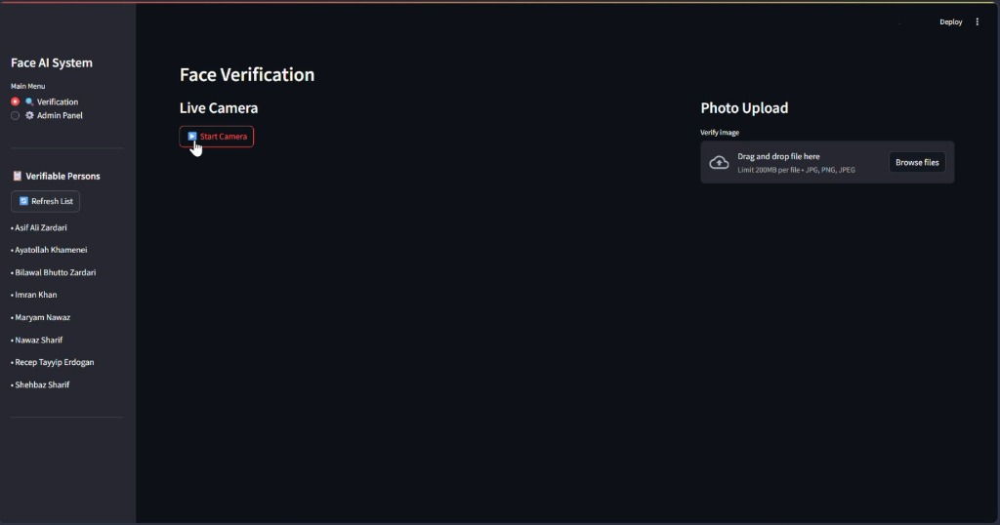
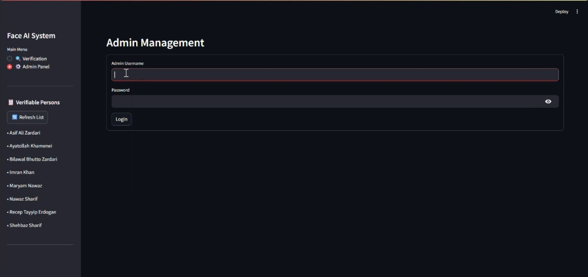
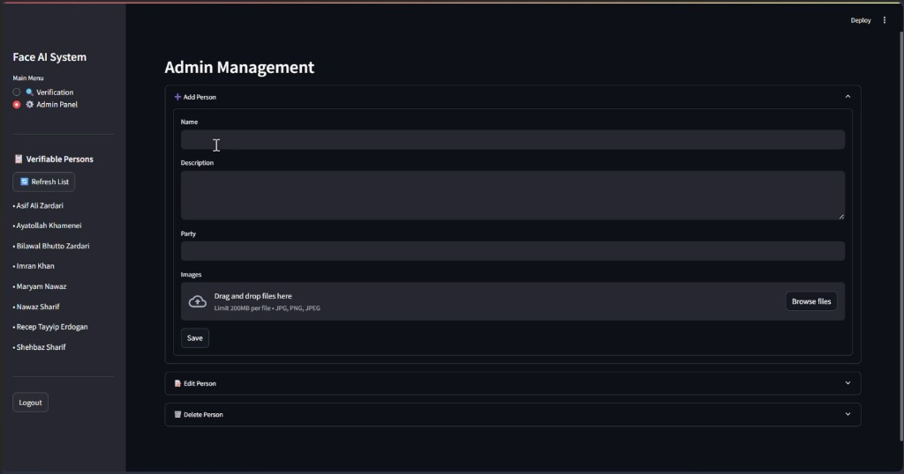
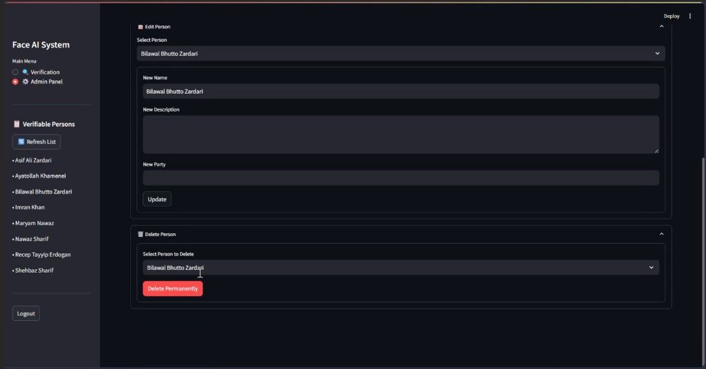

# 🏛️ Politician Face Verification System

A professional, real-time face identification application designed to verify politicians using a high-accuracy AI engine. Built with **FastAPI**, **Streamlit**, and **MongoDB**.

---

## 📸 Application Screenshots

### 🔍 Real-Time Face Verification & Photo Upload
Identify politicians in real time through the live webcam feed or by uploading an image for instant matching.


### 🔐 Admin Authentication Panel
Secure administrator login to access database management and system controls.


### ➕ Add New Politician Profile
Easily register new politicians with details (Name, Description, Party) and upload training photos.


### ✏️ Manage & Delete Politician Records
Update existing politician profiles or permanently remove records from the database.


---

## 🚀 Features

- **Real-Time Verification**: Smooth, zero-lag camera feed using background processing threads.
- **Manual Image Analysis**: Upload any photo to check for matches against the database.
- **Database Management**: Full Admin Panel to Add, Edit, and Delete politician records.
- **High Accuracy**: Optimized face recognition using `dlib` and 4x downsampling for speed.
- **Secure Access**: Protected Admin controls via authentication.

## 🛠️ Tech Stack

- **Frontend**: [Streamlit](https://streamlit.io/) (Python-based interactive UI)
- **Backend**: [FastAPI](https://fastapi.tiangolo.com/) (High-performance Python API)
- **AI Engine**: [Face Recognition](https://github.com/ageitgey/face_recognition) (dlib-based)
- **Database**: [MongoDB](https://www.mongodb.com/) (NoSQL storage for encodings and metadata)
- **Computer Vision**: [OpenCV](https://opencv.org/)

## 📋 Prerequisites

- Python 3.10+
- MongoDB installed and running locally
- Webcam (for live verification)

## 🔧 Installation & Setup

1. **Clone the Repository**:
   ```bash
   git clone https://github.com/Alishba-Hamid258/Face-Verification-App.git
   cd Face-Verification-App
   ```

2. **Set up Virtual Environment**:
   ```bash
   python -m venv venv
   source venv/bin/activate  # On Windows: venv\Scripts\activate
   pip install -r requirements.txt
   ```

3. **Configure Environment**:
   Create a `.env` file or update `config.py` with your MongoDB URI.

4. **Run the Backend**:
   ```bash
   python api.py
   ```

5. **Run the Frontend**:
   ```bash
   streamlit run frontend.py
   ```

## 🔐 Admin Credentials

- **Username**: `admin`
- **Password**: `secret123`

## 🤝 Contributing

Contributions are welcome! Please feel free to submit a Pull Request.
